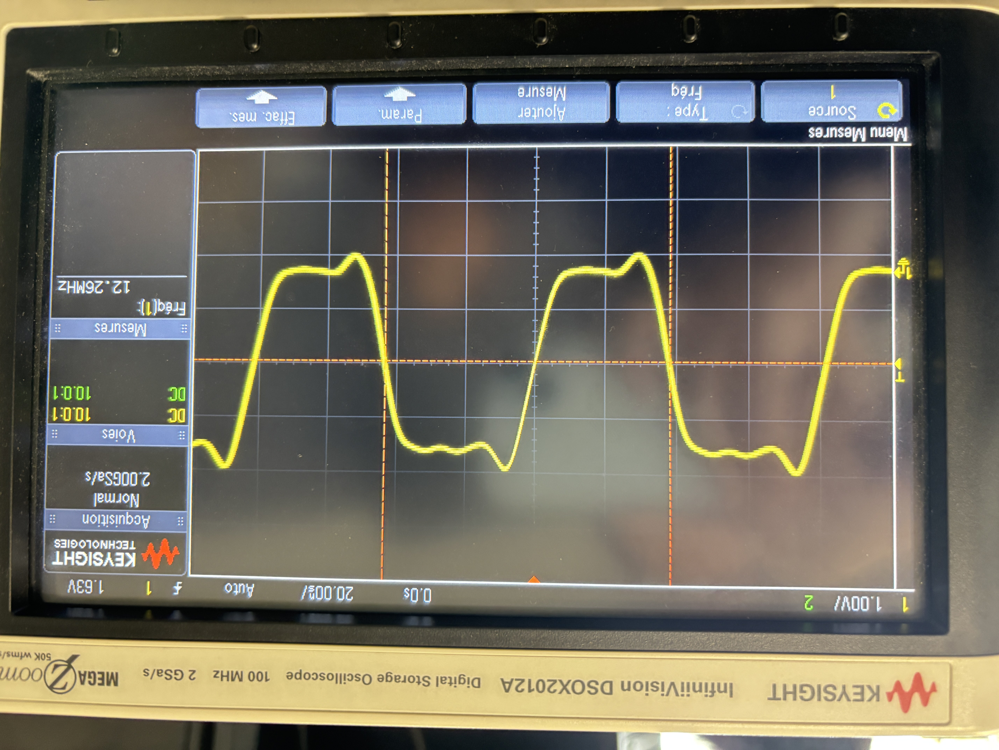
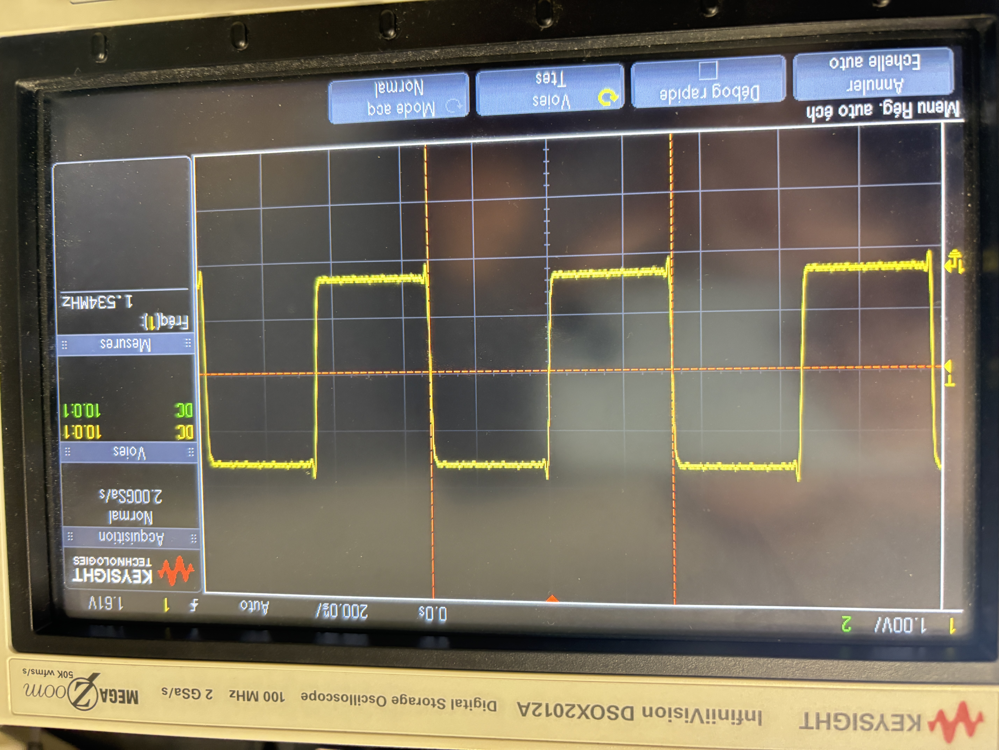
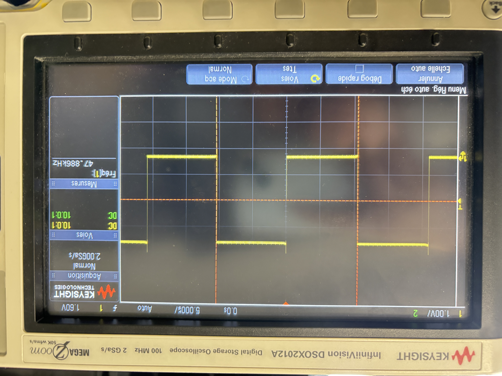
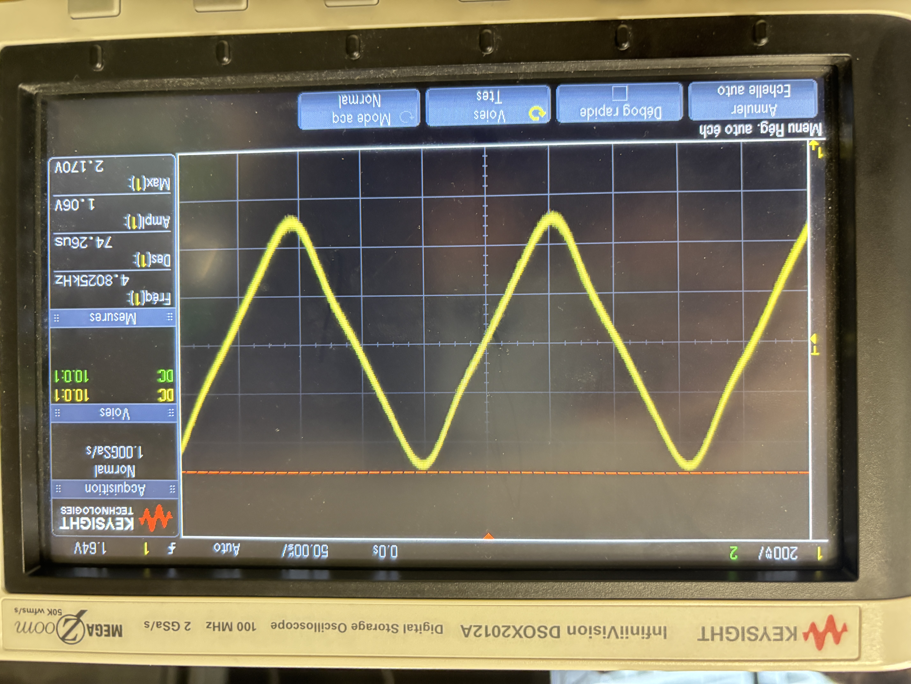

# tp_synthese_autoradio

## 2 Le GPIO Expander et le VU-Metre

### 2.1 Configuration

1. GPIO Expander : **MCP23S17**
2. Sur le STM32, le SPI1 est déjà utilisé.  
   On utilse alors le **SPI3** en full-duplex master avec :
   - SCK -> PC10
   - MOSI -> PB5
   - MISO -> PC11
   - CS -> PB7
   - RESET -> PA0
   - (A0 A1 A2 ) = 000
4. Paramètre pour configurer un SPI
     - Basic parameters
       - Frame Format : Motorola
       - Data Size : 8 bits
       - First Bit : MSB First
     - Clock Parameters
       - Prescaler -> Baudrate 10MHz
       - Clock Polarity : LOW (niveau logique au repos)
       - Clock Phase

## 3 Le CODEC Audio SGTL5000

### 3.1 Configuration préalables

1. Pin utilisé pour l'I2C
   - SDA -> PB11
   - SCL -> PB10
   - ==> correspondant à l'**I2C2**

### 3.2 Configuration du CODEC par l’I2C
5. Registres :
  - CHIP_ANA_POWER : 0x0030
  - CHIP_LINREG_CTRL : 0x0026      
  - CHIP_REF_CTRL : 0x0028
  - CHIP_LINE_OUT_CTRL : 0x002C
  - CHIP_SHORT_CTRL : 0x003C
  - CHIP_ANA_CTRL : 0x0024
  - CHIP_ANA_POWER : 
  - CHIP_DIG_POWER : 0x0002
  - CHIP_LINE_OUT_VOL : 0x002E
  - CHIP_CLK_CTRL : 0x0004
  - CHIP_I2S_CTRL : 0X0006
  - CHIP_ADCDAC_CTRL : 0x000E
  - CHIP_DAC_VOL : 0x0010

### 3.3 Signaux I2S

MCLK:

SCLK:

LRCLK:

### 3.4 Génération de signal audio

signal triangulaire:

